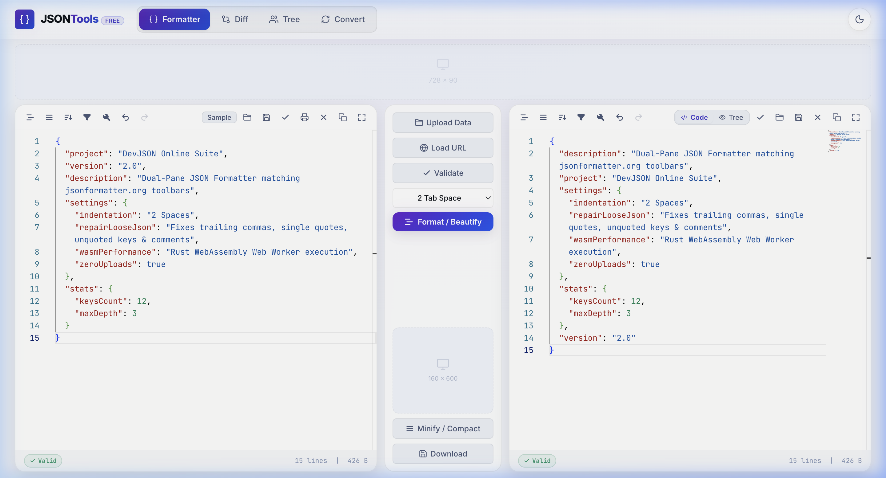

# JSONTools

A fast, client-side JSON toolkit built with React, Monaco Editor, and Rust WebAssembly.

Everything runs entirely in your browser — no server uploads, no logins, and zero tracking.

[](https://jsontools.mohammedrishad.com)
[](LICENSE)

---



---

## Features

- **Formatter & Validator**: Dual-pane Monaco editor with 2/4-space indent, minification, real-time syntax checking, and auto-repair for broken JSON (Python dicts, single quotes, trailing commas).
- **Diff Checker**: Side-by-side (Split) and unified (Inline) diff views with live additions/removals counters, character breakdowns, and key-normalized sorting.
- **Tree Visualizer**: Collapsible tree view to inspect complex nested structures with type badges and real-time JSONPath search (`$.settings.theme`).
- **Converter**: 100% in-browser conversions between JSON, YAML, CSV, and XML with schema validation.
- **Privacy First**: All formatting, diffing, and conversions happen locally on your machine using Rust WebAssembly Web Workers.

---

## Quickstart

### Prerequisites
- Node.js (v18+) & pnpm (or npm / yarn)
- Rust & Cargo (to compile the WebAssembly module)
- `wasm-pack`:
  ```bash
  npm install -g wasm-pack
  # or: cargo install wasm-pack
  ```

### Local Setup

```bash
# 1. Clone repo
git clone git@github.com:vkmrishad/json-tools.git
cd json-tools

# 2. Install dependencies
pnpm install

# 3. Build Rust Wasm engine
pnpm run wasm-build

# 4. Start dev server
pnpm dev
```
The dev server will be running at `http://localhost:5173`.

---

## Production Build & Deployment

### Build
Compiles Rust to Wasm, runs TypeScript checks, bundles the app to `dist/`, and outputs `CNAME` and `404.html` fallback:
```bash
pnpm run build
```

### Deploy to GitHub Pages (`gh-pages` branch)
```bash
pnpm run deploy
```

---

## Custom Domain Setup

The project is pre-configured to deploy to `jsontools.mohammedrishad.com`.

If you are setting this up on your own domain:
1. Copy `.env.example` to `.env` and set your domain:
   ```env
   VITE_SITE_URL=https://jsontools.mohammedrishad.com
   VITE_CUSTOM_DOMAIN=jsontools.mohammedrishad.com
   ```
2. Add a `CNAME` record in your DNS provider:
   - **Type**: `CNAME`
   - **Name**: `jsontools`
   - **Target**: `<your-username>.github.io`
3. Run `pnpm run deploy`.

---

## License

MIT License — feel free to use and adapt this project for your own needs.
